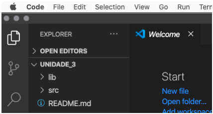
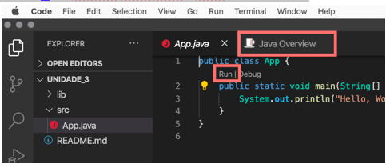
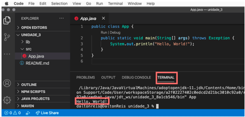

# Disciplina de Introdução à Programação

Olá, seja bem vindo ..

Este é o material principal da disciplina de Introdução à Programação. O
conteúdo está dividido em 7 (sete) unidades (pastas), seguindo o proposto no plano de
ensino. Cada unidade tem um texto de apoio e suas respectivas videoaulas, e
atividades, dependo da unidade.

Também tem a pasta "_exemplos" que contém códigos em Java que podem ser usados
nas unidades. Inicialmente é interessante executar o exemplo de código para
entender a sua programação, e depois usar partes deste código na atividade em
si.

Mas observe, as pastas serão disponibilizadas no decorrer do cronograma. Assim,
mais próximo do final do cronograma teremos a pasta "TrabalhoFinal" que irá conter o
material necessário para desenvolver a atividade final da disciplina.

Já para desenvolver a parte prática precisaremos de um computador (PC/Mac) com
um dos sistemas operacionais: Windows, Linux ou MacOS. O material teórico
(textos e videoaulas) até podem ser trabalhados com dispositivos móveis
(smartphones ou tablets), mas a parte prática exige um equipamento desktop.

## Ambiente de Desenvolvimento Prático

Para o desenvolvimento da parte prática precisamos de uma **Linguagem de
Programação** e uma **IDE** (Integrated Development Environment ou Ambiente de
Desenvolvimento Integrado).

### Instalando a Linguagem de Programação - Java

Para instalar o Java acesse o link

[https://adoptopenjdk.net/](https://adoptopenjdk.net/ "Para instalar o Java").

Selecionar OpenJDK 11 (LTS) e HotSpot. Clique no Último Lançamento, e assim irá
baixar um arquivo .msi. Depois dê dois clicks no arquivo, … e alguns next … mas
ATENÇÃO … se aparecer uma janela deste tipo

selecione a opção em vermelho. Assim a variável do sistema JAVA_HOME fica
definida para está instalação do Java.
… e depois, next, ..., finish.

### Instalando a IDE - VSCode

A IDE a ser utilizada será o Microsoft Visual Studio Code (VSCode). Além do
VSCode também será necessário instalar algumas **Extensions** (extensões) para
trabalhar com a linguagem de programação definida (no caso o Java).

#### Instalando o VSCode

Para instalar o VSCode acesse o link

[https://code.visualstudio.com/](https://code.visualstudio.com/ "Para instalar o
VSCode").

Selecione Versão para Windows – Stable Build.
Dois clicks no arquivo, e next, ..., next, finish.

#### Instalando as Extensions

A instalação das extensões é feita direto dentro do VSCode. Para isto, abra o
VSCode, é vá para barra lateral “Extensions”. No campo de texto que aparecer
digite: java, e na primeira ocorrência de “Java Extension Pack” clicar em
install.

Caso queira listar quais extensões está usando pode usar os comando em:  
Unix:  
> code --list-extensions | xargs -L 1 echo code --install-extension

Windows (PowerShell, e. g. using Visual Studio Code's integrated Terminal):  
> code --list-extensions | % { "code --install-extension $_" }

**Importante**: feche e abra o VSCode para efetivar as instalações das extensões.

### Testando o Ambiente de Desenvolvimento

Uma maneira prática de testar o ambiente que iremos usar é criando um "Hello
World" em Java. Para fazer este teste existe várias formas, uma delas é:

- No VSCode no menu "View / Command Palette …" digite/selecione "Java:  Create Java Project …".
  
  

- Selecione "No build tools" … espere um pouco … e quando aparecer a janela
  escolha um "local" para salvar o seu projeto. Após selecionar o "local" entre
  com um nome para seu projeto, e pressione "enter" para confirmar. O seu
  projeto deve ter sido criado, e aparecer algo deste tipo:<

- Agora selecione na janela esquerda do VSCode a pasta "src", e depois o arquivo "App.java". As vezes além de abrir a janela para mostrar o arquivo "App.java" também abre a janela "Java Overview" .. por enquanto podes fechar a janela "Java Overview".
  

- Agora clique em "Run" que aparece no texto da janela "App.java" entre as
  linhas 1 e 2. Assim deve aparecer uma nova janela abaixo da janela do texto do
  "App.java" com algumas linhas de texto .. é a janela do "TERMINAL". Nesta janela (do TERMINAL) deve aparecer o texto "Hello, World!".

- este texto é a mensagem que foi definida no programa "App.java" para ser escrito para o usuário … e … meus parabéns, já tens o PRIMEIRO programa em Java 😉.
  
- Para mais informações sobre como usar o Java no VSCode:
  [https://code.visualstudio.com/docs/java/java-tutorial](https://code.visualstudio.com/docs/java/java-tutorial
  "Uso do Java no VSCode")

## VSCode - passos iniciais

Para quem quiser aprender um pouco mais sobre a IDE VSCode segue alguns links:

- [Lista Geral](https://code.visualstudio.com/docs/getstarted/introvideos)
- [Começando](https://code.visualstudio.com/docs/introvideos/basics)
- [Edição de Código](https://code.visualstudio.com/docs/introvideos/codeediting)
- [Personalizar](https://code.visualstudio.com/docs/introvideos/configure)
- [Extensões](https://code.visualstudio.com/docs/introvideos/extend)
- [Depurando](https://code.visualstudio.com/docs/introvideos/debugging)
- [Controle de Versão](https://code.visualstudio.com/docs/introvideos/versioncontrol)
- [Customizar](https://code.visualstudio.com/docs/introvideos/customize)

## MS Live Share - Planned Session

Um opcional que se tem dentro do VSCode é instalar a extensão do "Live Share".
Está extensão permite criar sessões online para compartilhamento de tela. Mas
não é um simples compartilhamento de tela, mas também permite que se compartilhe
alguns (os principais) recursos que o editor de código do VSCode disponibiliza.
Para mais informações:

- sobre o Live Share acesse

  [https://docs.microsoft.com/pt-br/visualstudio/liveshare/](https://docs.microsoft.com/pt-br/visualstudio/liveshare/
  "Sobre o Live Share")

- para usar o Live Share no VSCode (Extension)
  
  [https://marketplace.visualstudio.com/items?itemName=MS-vsliveshare.vsliveshare-pack](https://marketplace.visualstudio.com/items?itemName=MS-vsliveshare.vsliveshare-pack
  "Instalar o Live Share")

## GIT (Controlador de Versão)

E outro opcional é instalar o GIT que serve para "versionar" códigos.
Para mais informações:

- sobre o GIT no VSCode acesse
  [https://code.visualstudio.com/docs/editor/versioncontrol](https://code.visualstudio.com/docs/editor/versioncontrol
  "Sobre o GIT no VSCode")

- sobre o GIT no geral
  
[https://git-scm.com](https://git-scm.com "Sobre o GIT")

- para usar o GIT
  
  [https://git-scm.com/download/win](https://git-scm.com/download/win "Instalar
  o GIT")

## OpenJDK Documentation

Para se aprofundar mais em Java tem a documentação oficial do OpenJDK:
[http://devdocs.io/openjdk/](http://devdocs.io/openjdk/ "Documentação do OpenJDK")
