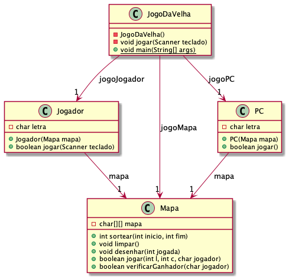
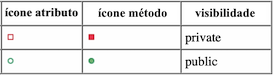

# Trabalho Final - Introdução à Programação

## Observações

- Só é permitido o uso de comandos estudados em sala de aula até o momento.
- As únicas estruturas de dados permitidas para a solução de problemas são variáveis primitivas, strings e matrizes.
- Nenhuma outra estrutura ou biblioteca é permitida, a não ser o uso do "import java.util.Scanner".
- As dúvidas referentes a este trabalho serão respondidas **somente** durante as aulas.
- Lembre de consultar o repositório de exemplos desta disciplina, pois pode ajudar no desenvolvimento deste trabalho (principalmente o exemplo Exemplo_Sortear.java).
- Uma vez apresentado o trabalho para avaliação, este não pode ser reapresentado.
- Os trabalhos podem ser desenvolvidos em **equipes de no máximo 3 alunos**. Prazo máximo para definir as equipes no AVA3 (Unidade7 / Definir equipes): 13/06.
- Mesmo sendo um trabalho desenvolvido em equipe, as notas podem ser diferentes para cada integrante, pois vai depender do conhecimento de cada integrante em relação ao conteúdo do trabalho apresentado.
- A apresentação só poderá ser feita após a equipe postar no AVA3 os fontes do trabalho. Somente um integrante da equipe deve postar o trabalho no AVA3.
- O código postado/apresentado não pode ter erros de execução (use comentários para tirar possíveis erros).
- A equipe deve avisar o professor pelo MS-Teams que deseja apresentar o trabalho.
- As avaliações serão feitas numa reunião pelo MS-Teams, com todos os integrantes da equipe. Nesta reunião todos os integrantes da equipe devem compartilhar a tela do seu computador e mostrar o código executando na IDE (VSCode ou outra). Também todos devem abrir a câmera durante a reunião (caso não tenhas um computador com câmera lembre que podes entrar simultaneamente no MS Teams pelo computador e pelo celular, e assim usar a câmera do celular).

## Enunciado

Com base nas seguintes descrições, implemente o problema do: **Jogo da Velha**.  
Para desenvolver este problema deve-se seguir fielmente a descrição das três classes abaixo.

### Classe JogoDaVelha

- *construtor* declara a única ocorrência do objeto teclado da classe Scanner para permitir ler dados do console usando o teclado;
- *construtor* instância:
  - objeto *jogoMapa* da classe *Mapa*,
  - objeto *jogoPC* da classe *PC*,
  - objeto *jogoJogador* da classe *Jogador*, e  
  para iniciar os atributos da classe *JogoDaVelha*;
- *construtor* controla se “Deseja jogar novamente”;
- método *jogar* “limpa" o mapa a cada nova partida usando o método *limpar* da classe *Mapa*;
- método *jogar* sorteia quem inicia a partida (jogador ou PC) usando o método *sortear*;
- método *jogar* tem a variável que conta quantas jogadas já foram executadas;
- método *jogar* chama o método que *desenhar* da classe *Mapa*;
- método *jogar* tem o laço que controla as jogadas, alternando a vez entre jogador e PC.

### Classe Mapa

- mapa é definido pelo tipo primitivo *char*;
- implementa o método *sortear* disponível em Exemplos;
- usar o carácter ' ' (espaço em branco) para limpar o mapa;
- a cada jogada testar quem venceu a partida (jogador ou PC);
- considerar o caso de empate no final da partida;
- testar no método *jogar* se a linha e coluna recebida representa uma célula livre no mapa, e em caso positivo marcar nesta célula quem jogou (usar a letra).

### Classe PC

- a jogada do PC deve ser representada pelo carácter 'O' (sua letra);
- usar o método *sortear* para definir a próxima jogada do PC;
- a cada jogada testar se o PC venceu (usando o método *verificarGanhador*), e neste caso imprimir " ... PC GANHOU!".

### Classe Jogador

- a jogada do jogador deve ser representada pelo carácter 'X' (sua letra);
- usar o método *jogar* para ler linha e coluna do teclado;
- a cada jogada testar se o jogador venceu (usando o método *verificarGanhador*), e neste caso imprimir " ... Jogador GANHOU!";
- verificar se os valores de linha e coluna são válidos (dentro dos limites do mapa).

## Atenção

O código **deve** seguir as informações descritas nos diagramas de Classes referente aos nomes das classes, atributos, métodos, parâmetros e qualificadores (visibilidade: public/private).

## Exemplo da execução

As mensagens mostradas ao executar o código deste trabalho devem seguir o que é mostrado ao executar o [JogoDaVelha.jar](JogoDaVelha.jar).

## Como executar um JAR

- Abra o console do Windows pressionando a tecla Windows e depois digitando “cmd" e pressionar “enter”. Se for Linux ou MacOS abra o “terminal"  

- Agora mude de pasta, para pasta que tem o **JogoDaVelha.jar**. No meu caso para pasta de Download  

- E para executar digitar

  > java -jar JogoDaVelha.jar

- Pronto, é só usar (jogar) ... e ver como deve ficar as saídas.
  
