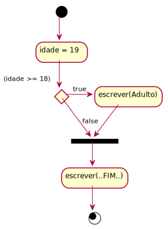
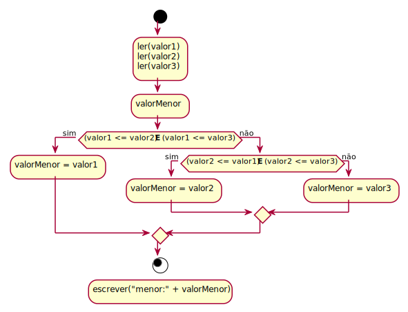
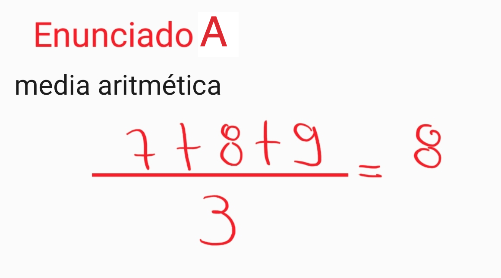
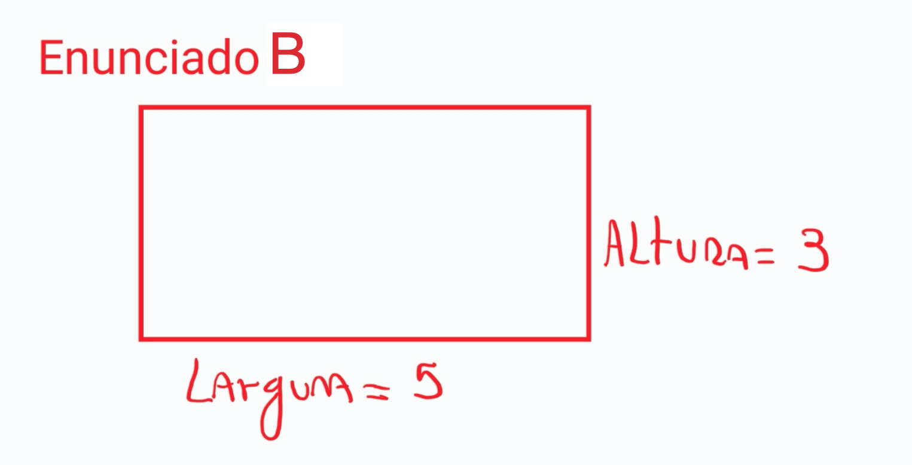

# Algumas anotações das aulas

## Apresentação do AVA3

### Disciplina
- Avisos: os avisos serão feitos todos pelo Teams
- Apresentação do Professor
  
        Nome: Luciana Pereira de Araújo Kohler
        2008-2012: Graduação na FURB
        2012-2014: Mestrado (M.Sc.) na UDESC.. Área Sistemas Colaborativos / Interação Humano Computador
    
- Leciono atualmente:

        1a fase - Introdução à Programação (noturno)
        3a fase - Programação Web I (matutino)
        4a fase - Programação Web II (noturno)
        5a fase - Testes de Software (concentrado)
        8a fase - Desenvolvimento de Jogos e Entretenimento Digital
       

- Linhas pesquisa:

        projetos relacionados com as disciplinas
        assuntos relacionados com a área da educação
        Grupos de Pesquisa: LDTT e Meninas Digitais
        Oportunidade para fazer pesquisa: ser bolsista

------
## Plano de Ensino
Ler com **muita ATENÇÃO**, e em caso de dúvida me questionem.

- Quantidade de créditos: 6 + 1 (atividades em casa)
- Sala de aula invertida
- Divisão das unidades e conteúdo de cada unidade
- Avaliações: prazos nas atividades no AVA3 dentro das unidades, e no cronograma
- Referências bibliográficas: algumas, usem o mostrado em aula .. cuidado para não perder o foco
  
## Conteúdo
### Apoio
- links gerais de toda a disciplina
  - cronograma: divisão das unidades, qual conteúdo, prazos de entrega
  - repositório: todo o conteúdo da disciplina e os exercícios das atividades práticas
  - horário da monitória

### Unidade 1
- link do Conteúdo
- atividade: questionário
- ambiente de desenvolvimento


## Ambiente de Desenvolvimento
- Java OpenJDK
- IDE (ambiente de desenvolvimento) VSCode

------
## Visão Geral do Conteúdo
- muitas palavras novas que serão explicadas mais para frente
- vai parecer algo muito abstrato

### Algoritmos
- problema: algo (as vezes imaginável) para ser resolvido
- desenvolvimento da ideia
- formalização da ideia
- codificação: linguagem de programação
- testes
- arrumar problemas encontrados
- testes
- usar ... 😉 ... e rezar para o usuário não aparecer com novos problemas, mas sim com novas necessidades

#### Algumas dicas
##### Desenvolvimento da ideia / Formalização da ideia
- praticar, praticar, ... praticar ..
- aprender com problemas já resolvidos
- resolveu, se der tempo, não poderia resolver da  melhor forma
- não desista, nunca, jamais ... desistiu, volte a insistir

    

- divisão e conquista ... subdividir em rotinas
- Etapas: Entrada / Processo / Saída

 
 
##### Codificação: linguagem de programação
- Exemplo, algo parecido com formalismo usado na Matemática (mas melhor 😉 )

  <kbd>

  <br>
  <br><br>

  <br><br>

  <br><br>
  
  <br>
  <br>
  
  </kbd>

- Exemplo, na Computação, uma representação gráfica:
  - Fluxograma de uma rotina condicional simples
  
<div hidden>

```
@startuml AA_Exemplo_1_Condicional_Simples
  (*) --> "idade = 19" 
  if "(idade >= 18)" then
    ->[true] "escrever(Adulto)"
    --> ===REDIRECT_CHECK===  
  else
    -->[false] ===REDIRECT_CHECK===
  endif
  --> "escrever(..FIM..)"
  -->(*)
@enduml
```
</div>

  

  - Fluxograma de uma rotina para ordenar três valores

  <div hidden>

  ```
  @diagramação Achar menor valor entre três valores:
  @startuml AA_Exemplo_99_ordenarTresValores
    start
      :ler(valor1)
      ler(valor2)
      ler(valor3);
      :valorMenor;
      if ((valor1 <= valor2) **E** (valor1 <= valor3)) then (sim)
        :valorMenor = valor1;
      else (não)
        if ((valor2 <= valor1) **E** (valor2 <= valor3)) then (sim)
          :valorMenor = valor2;
        else (não)
          :valorMenor = valor3;
        endif
      endif
    stop
    :escrever("menor:" + valorMenor);
  @enduml
  ```
  </div>

  

## Como fica na prática
- irei demonstrar usando o nosso ambiente de desenvolvimento (Java+VSCode), mas não se preocupem ... hoje não iremos estudar este ambiente ... é só para demonstrar o processo de **Solução de Problemas**:
  - entender o problema​
  - verificar as entradas
  - identificar saídas
  - definir processos
  - descrever solução formalmente
  - testar

Também vamos assumir uma forma simples de entrar com os valores ..

ATENÇÃO: lembrem de irem instalando o "Ambiente de Desenvolvimento Prático" ..

------
### Exemplos de Enunciados

#### Enunciado A
As vezes o enunciado pode ter "gorduras" ...

    Era uma vez, uma pessoa que estava na praia. Esta pessoa conhecia um professor e este professor tinha um problema para resolver. O seu problema era que ele tinha que considerar uma situação que ele poderia ter 3 notas de um aluno e com elas poderia calcular a média deste aluno.

Ou ainda um enunciado "magrinho", mas as vezes se tem situações com falta de informações que não permitem solucionar o problema ... no caso, quantas notas para calcular a média?

    Considerando que um professor tem notas de um aluno, calcule média do aluno.

Uma aceitável e se ter uma descrição sucinta, mas que tenha todas as informações necessárias para poder resolver o problema.

    Um professor deseja calcular a média de um aluno. O professor tem o nome e as 3 notas do aluno e a média deve ser calculada de forma aritmética.​

Então vamos para primeira etapa:
- entender o problema​: Se pergunte, você consegue resolver este problema sem o uso do computador? Caso não consiga, bem provável é porque você não entendeu o enunciado ou falta informações, conhecimento, de como resolver o problema.



Uma forma de ajudar a entender o problema é extrair do enunciado:
  - as entradas
  - as saídas
  - e definir os processos

**Então tente separar em:**

__ Desnecessário __

    Um professor deseja 
    O professor tem o nome

__ Não usado __

    nome

__ Entrada __
    // ter as 3 notas
    Nota1 = 7
    Nota2 = 8
    Nota3 = 9

__ Processo __
    // Calcular a média
    média = (nota1 + nota2 + nota3) / 3

__ Saída __
    // escrever a média
    escrever(média)

Bom, depois destas etapas vamos para:
  - descrever solução formalmente
 .. vou mostrar como é no nosso ambiente

__ descrever solução formalmente __

    código em Java


E por fim, e muito importante
  - testar: Para testar se precisa ter valores de **entrada**, e principalmente saber quais valores de **saída** serão gerados com estas **entradas**.

| Entrada       | Saída                                     |
| ---------- | --------------------------------------------- |
| Nota1 = 5.0, Nota2 = 7.0, Nota3 = 9.0 | Média = 7.0​ |
| Nota1 = 4.0, Nota2 = 6.0, Nota3 = 5.0 | Média = 5.0​ |
| Nota1 = 7.0, Nota2 = 5.0, Nota3 = 1.5 | Média = 4.5​ |

----
#### Enunciado B

Mais um problema a ser resolvido ...

    Modele a solução de um problema para calcular a área de uma sala retangular. 
    Considere que as medidas estão expressas em metros.

Então vamos para primeira etapa:
- entender o problema​: faça o cálculo na "mão". Use os valores de testes (abaixo) para verificar se seu calculo está certo.



**Então tente separar em:**

__ Desnecessário __ 

    Modele a solução de um problema para
    de uma sala 
    Considere que as medidas estão expressas em metros.

__ Não usado __ 

    metros

__ Entrada __
    /  ter a largura e altura
    largura = 3
    altura = 7

 __ Processo __
    // calcular a área  retangular 
    area = largura x altura

 __ Saída __ 

    escrever(area)


 __ descrever solução formalmente __ 

    código em Java


  - testar

| Entrada       | Saída                                     |
| ---------- | --------------------------------------------- |
| largura = 10, comprimento = 10 | área = 100​ |
| largura =  5, comprimento =  7 | área =  35​ |
| largura =  3, comprimento = 90 | área = 270​ |
