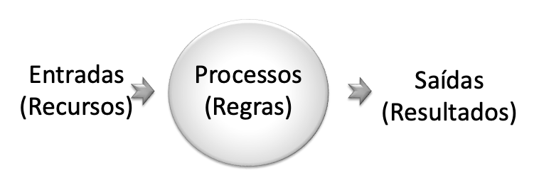

# Introdução à Programação - Unidade 2

## Construção de Algoritmos
> Vídeo aula (2_VideoAula-1 16:19):  
> Vídeo aula (2_VideoAula-1 16:19):  

### Solução de Problemas

### Etapas para a Solução de Problemas​
- A **especificação** da solução de um problema com base em um software exige algumas **etapas** (requisitos) fundamentais:​
  - entender o problema proposto (**interpretação**);​
  - verificar os **dados** e recursos disponíveis para resolvê-lo (**entradas**);​
  - identificar os **dados** ou resultados que se deseja alcançar (**saídas**);​
  - definir e redigir os passos gerais para a solução do problema (**processos** ou **regras**);​
  - descrever formalmente os passos para a solução do problema em uma linguagem clara e sem ambiguidades (**representação da solução**);​
  - testar a solução (**testes**).​
- Após a análise e modelagem do problema é que se passa para o processo de implementação computacional do programa (**programação**).​

### Identificar Dados de Entrada e Saída​
- Um problema computacional normalmente manipula dados e informações.​
- As entradas e saídas de um programa são obtidas através da análise dos **substantivos**.​
- Os dados podem ser divididos em três tipos:​
  - dados de entrada: são as informações ou recursos disponíveis para resolver um determinado problema utilizando o computador.
  - dados intermediários: são informações intermediárias que ocorrem ao longo de um processo de solução do problema, mas que ainda não são a solução desejada.
  - dados de saída: são as informações que se deseja obter como resultado do problema.
- Em um programa de computador **dados** são tratados como **variáveis**.​
- As **variáveis** armazenam valores na memória do computador e são caracterizadas por seu tipo.​
- Os tipos primitivos são destacados a seguir:​
  - Numérico Inteiro​: contém um número natural​ (ex.: Idade = 18 ou Quantidade = 3);
  - Numérico Real: contém um número com casas decimais (ex.: Salário = 1215,76​ ou Altura = 1,95);
  - Alfanumérico: contém caracteres ou sequências de caracteres alfanuméricos​ (ex.: Letra = ‘A’ ou Símbolo = ‘@’);
  - Lógico: contém verdadeiro ou falso​ (ex.: Sucesso = verdadeiro ou Triste = falso).

##### Exemplos
- Problema 1: considerando que um professor tem 3 notas de um aluno, calcule a média do aluno.​

        entradas: 3 notas (numéricos reais)​
        saída: média (numérico real)

- Problema 2: considerando que uma pessoa tem a largura e o comprimento de uma sala retangular, calcule a área da sala.​

        entradas: largura e comprimento (numéricos reais)​
        saída: área (numérico real)​

### Descrever a Solução do Problema​
- Na descrição da solução de um problema utilizam-se **expressões** e **operadores**.
- As **expressões** têm por finalidade verificar ou transformar os dados em um algoritmo.
- As expressões contam com **operadores** que permitem realizar as ações sobre os dados de um determinado algoritmo.​

#### Expressões/Operações/Comandos​
| Tipo       | Descrição                                     |
| ---------- | --------------------------------------------- |
| Atribuição | Existem informações em um programa que precisam ser armazenadas em **variáveis**. Nestes casos, utiliza-se uma expressão de atribuição.​  A atribuição é representada por um flecha para a esquerda ( <- ) ou pelo sinal de igual ( = ) |
| Entrada e Saída | Os programas normalmente recebem e informam dados executando operações denominadas de entrada (comando “ler”) e saída (comando “escrever”).
----------

### Exercícios
- Responda o quiz no AVA3​.
- Acompanhe os exercício em sala​.

----------

## Construção de Algoritmos
> Vídeo aula (2_VideoAula-2):  
> Vídeo aula (2_VideoAula-2):  

### Descrever a Solução do Problema​
| Tipo       | Descrição                                     |
| ---------- | --------------------------------------------- |
| Estruturas de Controle de Seleção e Repetição | Em um programa podem existir comandos executados apenas em determinadas situações. Nestes casos utilizam-se as estruturas de seleção.  Em outras situações, um comando precisa ser executado repetidas vezes. Nestes casos, utilizam-se as estruturas de repetição.​ |
| Chamadas de Sub-rotinas | Muitas vezes em um programa, a solução de um **algoritmo**, requer a execução de outros **algoritmos**. |
| Tratamentos de Erros| Muitas situações na programação de computadores requerem cuidado pois podem gerar diversos tipos de erros. Nas linguagens mais modernas, existem estruturas específicas para o tratamento destes erros. |
----------

### Operações de Atribuição​
- Um comando de atribuição permite que o **resultado de uma expressão**, ou o valor de uma variável ou constante seja armazenado em uma **variável**.​
- O comando de atribuição indica que a variável deve receber um conteúdo.​
- O símbolo que representa uma atribuição é uma seta apontada para a esquerda (←), que indica que o valor da expressão à direita deve ser armazenado na variável à esquerda:
  - Exemplo 1

        atribuir o valor 5 à variável A​​
        A ← 5​
        
  - Exemplo 2

        atribuir o valor de A somado de 2 unidades à variável B
        B ← A + 2​

  - Exemplo 3

        concatenar dois nomes com um espaço​​
        nome ← nome1 + " " + nome2​

### Operadores
| operador | descrição |
| -------- | --------- |
| +, - | operadores unários: são aplicados a um único operando. São os operadores aritméticos de maior precedência. Exemplos: -3, +x |
| +, -, *, / | operadores aritméticos: são aplicados para adição, subtração, multiplicação e divisão respectivamente. Por convenção, * e / têm precedência sobre + e -. Para modificar a ordem de avaliação das operações, é necessário usar parênteses como em qualquer expressão aritmética |
| % | operador de resto: é aplicado para o resto da divisão de números inteiros. Por exemplo, 8 % 3 = 2. Tem a mesma precedência do operador de divisão tradicional. Estes operadores podem variar de acordo com a notação utilizada pela pseudolinguagem |
| + | operador de caracteres: operador de concatenação de cadeias de caracteres, quando usado com dois valores (variáveis ou constantes) do tipo "caractere". Por exemplo: "Rio " + " de Janeiro" = "Rio de Janeiro" |
----------

